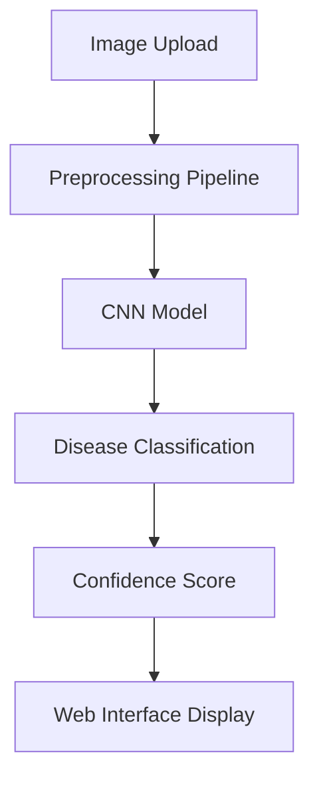

# 🍎 HarvestGnosis

<div align="center">


<h3>Neural Networks in Disease Detection for Pomegranate Fruits</h3>
<p>AI-Powered Solution for Automatic Disease Detection in Agriculture</p>
<p>
  <a href="https://github.com/Razvanix445/MIASC/releases/tag/v1.0.0">Download Latest Release</a>
</p>

</div>

[Video Presentation](https://github.com/user-attachments/assets/f42a9bcc-c895-4483-91de-6e02f2030de7)

---

## 📌 Project Overview

HarvestGnosis is an innovative artificial intelligence-based solution for automatic detection of pomegranate fruit diseases. Using advanced deep learning techniques, our system classifies five disease categories with **66.94% accuracy**, providing farmers with quick diagnostics for informed harvesting and treatment decisions.

### 🎯 Key Objectives
- Accurate identification of 5 main pomegranate diseases
- Reduced diagnostic time for farmers
- Optimized harvesting and treatment processes
- Minimized crop losses through early detection

### ✨ Key Features
- 🔍 **Real-time Disease Detection**: Instant analysis of pomegranate images
- 🎯 **5 Disease Classifications**: Healthy, Alternaria, Anthracnose, Bacterial Blight, Cercospora
- 📊 **Confidence Scoring**: Detailed confidence percentages for each prediction
- 🖥️ **User-friendly Interface**: Intuitive web application with drag-and-drop functionality
- 🚀 **Standalone Executable**: Easy deployment without complex setup
- 🧠 **Advanced CNN Architecture**: Custom deep learning model optimized for pomegranate diseases

## 🏗️ System Architecture



## 🤖 AI Model Details

### Model Architecture (Improved CNN)

```
Input Layer (224x224x3 RGB images)
    ↓
Conv2D (32 filters, 3x3) + ReLU + MaxPooling2D (2x2)
    ↓
Conv2D (64 filters, 3x3) + ReLU + MaxPooling2D (2x2)
    ↓
Conv2D (128 filters, 3x3) + ReLU + MaxPooling2D (2x2)
    ↓
Flatten Layer
    ↓
Dense (256 neurons) + ReLU + Dropout (0.5)
    ↓
Dense (5 neurons) + Softmax (Output Layer)
```

### Training Parameters
- **Optimizer**: Adam (learning_rate=0.001)
- **Loss Function**: Categorical Crossentropy
- **Batch Size**: 64
- **Epochs**: 30
- **Validation Split**: 20%
- **Callbacks**: EarlyStopping, ReduceLROnPlateau, ModelCheckpoint

## 📊 Performance Metrics

### Model Comparison

| Model        | Accuracy | Precision | Recall | F1 Score | Loss   |
|-------------|----------|-----------|--------|----------|--------|
| Simple CNN  | 49.51%   | 50.08%    | 49.51% | 41.29%   | 1.2515 |
| **Improved CNN** | **66.94%** | **67.59%** | **66.94%** | **57.48%** | **1.0883** |

**📈 Improvement: +17.43% accuracy**

### Per-Class Performance

| Disease Class     | Precision | Recall | F1-Score | Support |
|------------------|-----------|--------|----------|---------|
| Alternaria       | 0.65      | 0.63   | 0.64     | 179     |
| Anthracnose      | 0.71      | 0.69   | 0.70     | 235     |
| Bacterial Blight | 0.68      | 0.67   | 0.67     | 194     |
| Cercospora       | 0.62      | 0.64   | 0.63     | 128     |
| Healthy          | 0.72      | 0.71   | 0.71     | 289     |

## 📁 Dataset

- **Source**: [Kaggle Pomegranate Fruit Diseases Dataset](https://www.kaggle.com/datasets/sujaykapadnis/pomegranate-fruit-diseases-dataset)
- **Total Images**: 5,125 (after preprocessing)
- **Resolution**: 3120x3120 → 224x224 pixels
- **Classes**: 5 categories
- **Distribution**:
  - Healthy: 28.2%
  - Anthracnose: 22.9%
  - Bacterial Blight: 18.9%
  - Alternaria: 17.5%
  - Cercospora: 12.5%

## 🚀 Quick Start

Download the latest release from our [Releases page](https://github.com/Razvanix445/MIASC/releases/tag/v1.0.0) and run:
```bash
HarvestGnosis.exe
```

## 🛠️ Technology Stack

### Backend
- Python 3.8+
- Flask (REST API)
- TensorFlow (Deep Learning)
- OpenCV 4 (Image Processing)
- NumPy (Numerical Operations)
- Pandas (Data Manipulation)

### Frontend
- Vue.js (UI Framework)
- Axios (HTTP Client)
- HTML/CSS

### Deployment
- PyInstaller (Executable Creation)
- Flask-CORS (Cross-Origin Resource Sharing)

## 🔬 Research Methodology

### Data Preprocessing Pipeline
1. Image resizing: 3120x3120 → 224x224 pixels
2. Color space conversion: BGR to RGB
3. Normalization: MinMaxScaler (0-1 range)
4. Outlier detection: Z-score and IQR methods
5. Train-test split: 80%-20% stratified

### Experiment Results
- **Experiment 1**: Simple CNN with 2 convolutional blocks → 49.51% accuracy
- **Experiment 2**: Improved CNN with 3 convolutional blocks → 66.94% accuracy
- **Key Finding**: Additional convolutional layer and optimized parameters led to 17.43% improvement

## 🔄 Future Improvements

- [ ] Develop mobile application for field use
- [ ] Implement disease localization with segmentation
- [ ] Include treatment recommendations
- [ ] Extend support to other fruit types

## 👥 Team

- **Răzvan Călăuz** - Model Architect, Evaluation Specialist, ML Engineer
- **Octavian Coșofreț** - Data Engineer, ML Engineer

---

<div align="center">
  <p>⭐️ If you found this project helpful, please consider giving it a star!</p>
  <p>Made with ❤️ by Team FruitGuardians</p>
</div>
